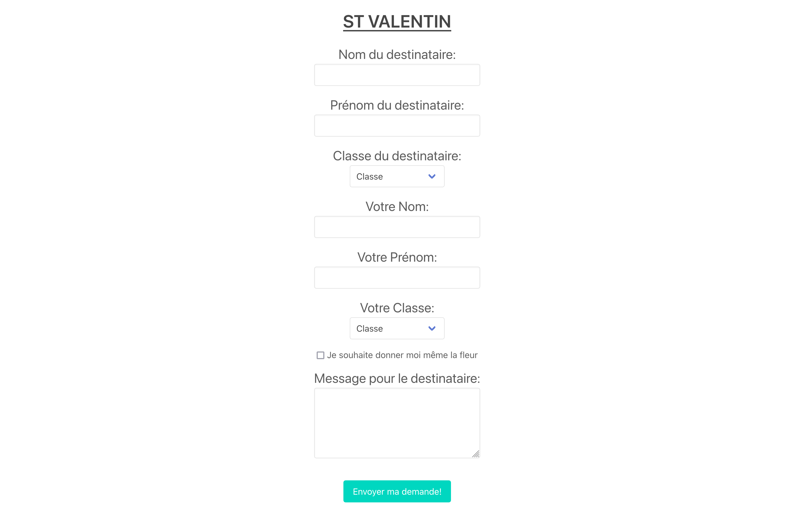
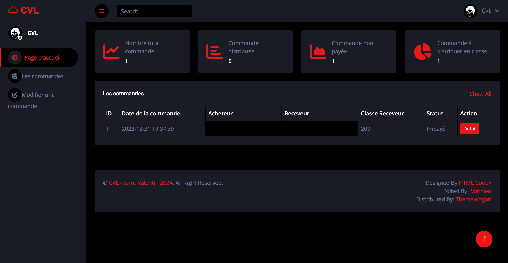
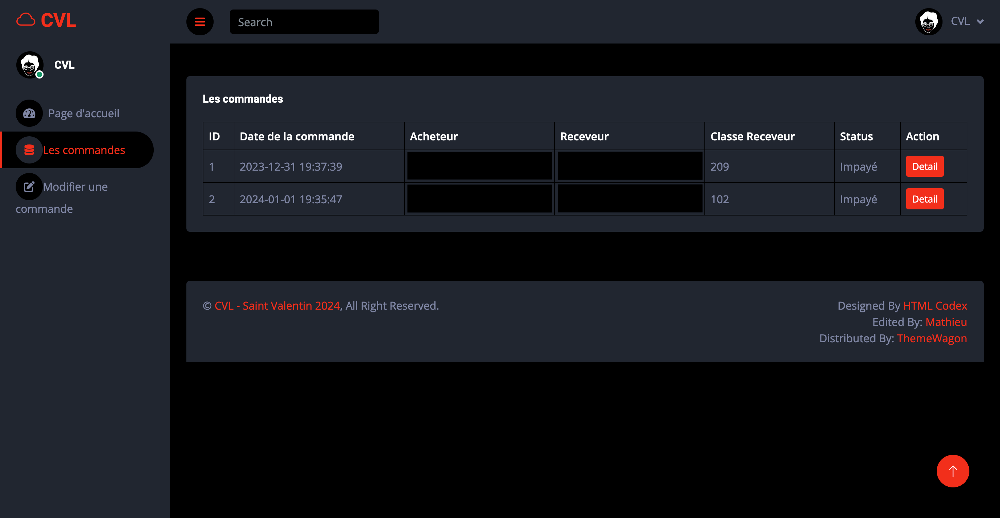
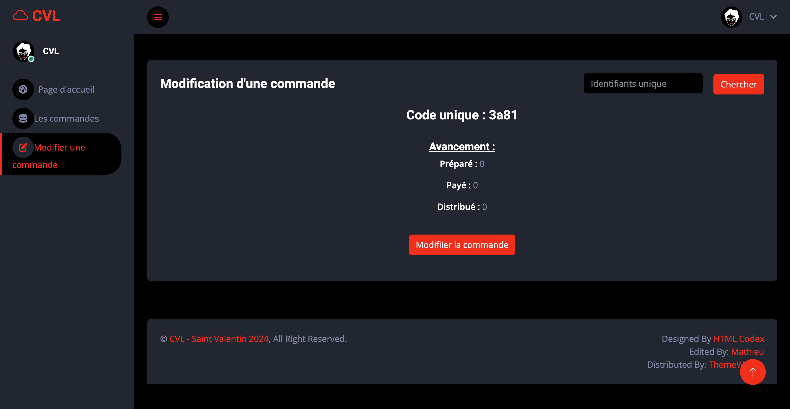

## CVL-COMMANDE-FLEUR

Ce projet est un site de commande de fleur créé pour l'événement de la Saint Valentin de mon Lycée.


### Table des matières
[Installation](#installation)\
[Licence](#licence)\
[Aperçu](#aperçus)

Ce projet contient une page "visiteur" qui sert à passer commande.
Pour la partie "gérant", ce projet contient un panel ([lien de la template](https://themewagon.com/themes/free-bootstrap-5-admin-dashboard-template-darkpan/)) qui sert à la gestion des commandes. 


### Installation
Pour fonctionner, une base de données MySQL/MariaDB doit être utilisé.

1 - Clonez le dépôt sur votre machine : ```git clone https://github.com/Matyu9/CVL-COMMANDE-FLEUR && cd CVL-COMMANDE-FLEUR```

2 - Installez les dépendances python: ```pip install -r requirements.txt```

3 - Créez un fichier `config.json` et remplissez-le à l'aide de cette template:

```
{
  "database_username": "",
  "database_password": "",
  "database_address": "",
  "database_name": "",
  "database_port": INT,
  "port": INT,
  "login_password": "",
  "login_cookie": ""
}
```

4 - Lancez le fichier `app.py` : ```python3 app.py```

### Licence

Apache 2

### Aperçus






